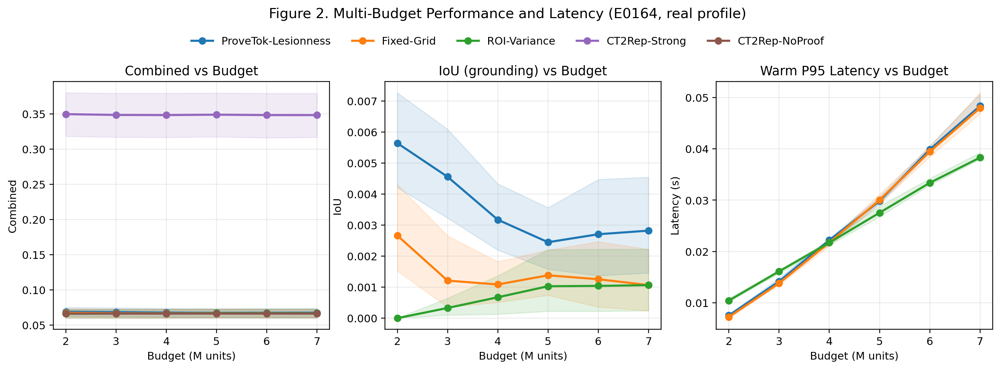
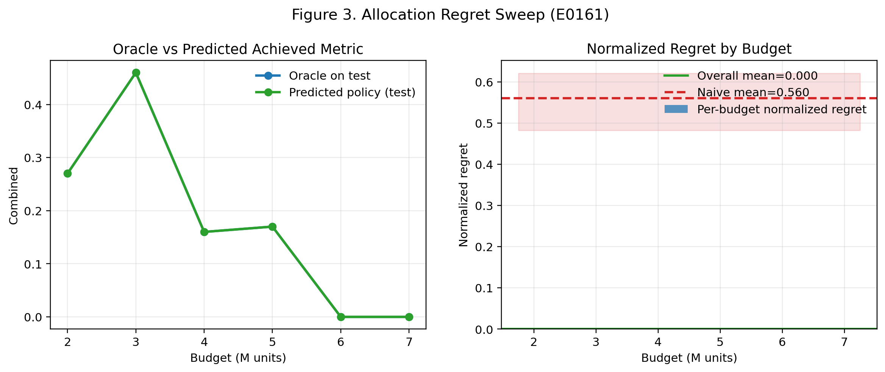
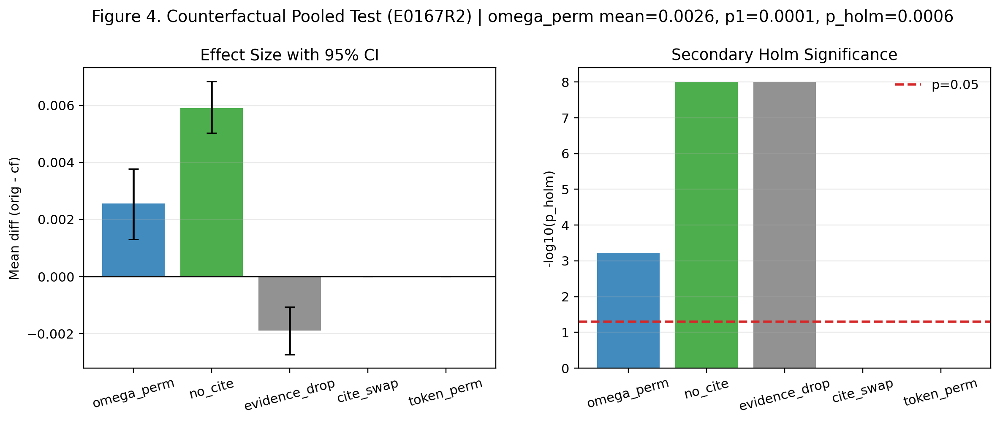
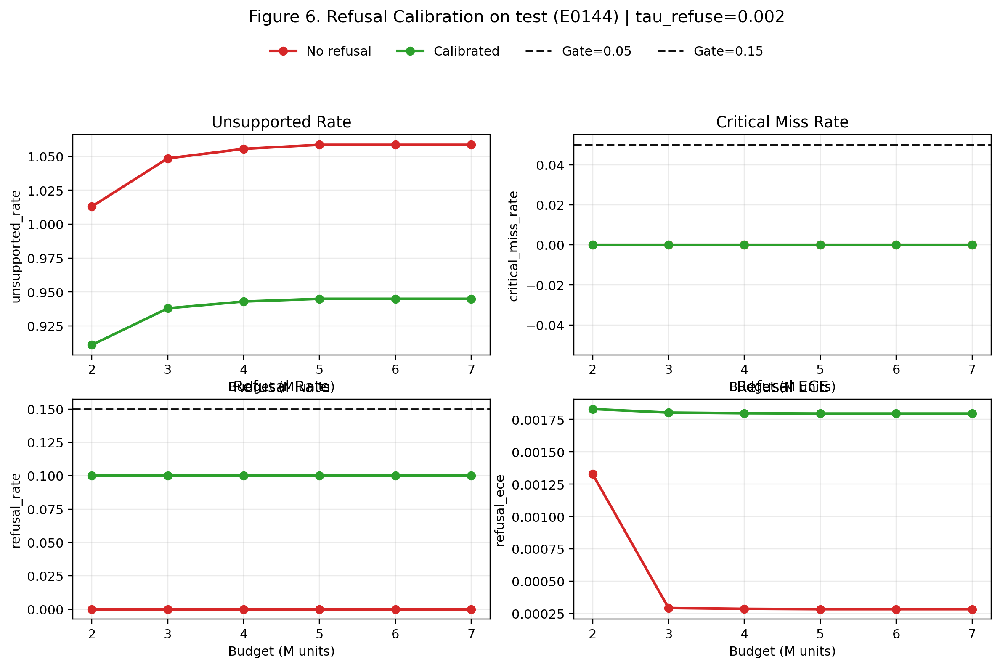
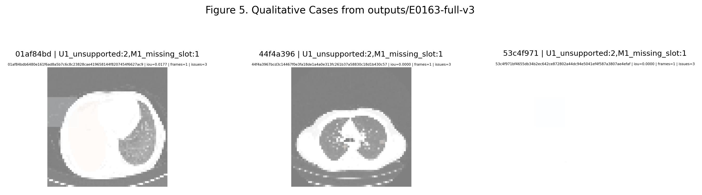

# ProveTok: Proof-Carrying Budgeted Evidence Tokenization for Grounded 3D CT Report Generation

> 文档版本：2026-02-07（paperized README）  
> 主审计状态：`outputs/oral_audit.json` -> `ready_for_oral_gate=true`  
> 最新 counterfactual 强证据：`outputs/E0167R2-ct_rate-tsseg-effusion-counterfactual-power-seed20/omega_perm_power_report.json`

## Abstract
3D CT 报告生成不仅要“像报告”，还要能回答“每句话的证据在哪里、是否可复核、证据不足时是否拒答”，并且必须在预算受限下可控延迟与可信门槛。我们提出 ProveTok，把预算分配、证据 token 化（BET）、可携证生成（PCG）、校验器与拒答校准统一为闭环协议，在固定预算 `B = B_enc + B_gen` 下输出文本、citations 与 verifier trace。我们采用多预算、多随机种子、paired bootstrap + Holm 的统计口径，并用 claim-level 机器裁判（`scripts/proof_check.py` / `scripts/oral_audit.py`）做可审计的结论判定。当前 `real` profile 下 C0001-C0006 全部通过；在跨域 V0003（silver label）路径中，`omega_perm` 在 seeds `0..19` 的 pooled 检验达到 `mean_diff=+0.002567`、`p_one_sided=0.0001`、`p_holm=0.0006`（详见 Table 4），支持“citation 机制在反事实压力测试下对 grounding 指标具有非平凡影响”这一可机检主张。

## TL;DR（Oral 速览）
- 一张表抓主证据：`docs/paper_assets/tables/table4_oral_minset.md`（下文 §5.0 也内嵌同表）。
- 图表可复现：`python scripts/paper/build_readme_figures.py` / `python scripts/paper/build_readme_tables.py`（产物在 `docs/paper_assets/`）。
- 机器审计门：`python scripts/proof_check.py --profile real` + `python scripts/oral_audit.py --strict`（产物 `outputs/oral_audit.json`）。

## 1. Introduction
### 1.1 问题与动机
面向 3D CT 的报告生成，不仅要求文本“像报告”，还需要回答“每句话的证据在哪里、是否可复核、证据不足时是否拒答”。已有方法常在文本质量与可解释性之间折中，且在预算受限场景中难以稳定控制 latency 与 trustworthiness。

### 1.2 本文目标
我们以“可证明生成”为中心目标：
1. 在固定预算下保持多预算质量/效率可比。
2. 让每个 frame 携带 citation 与 verifier trace，而非后验解释。
3. 将 refusal 纳入硬约束，避免“封嘴换指标”。
4. 用反事实与跨域评测证明 citation 非装饰。

### 1.3 主要贡献
1. 提出 BET + PCG + Verifier + Refusal 的统一闭环协议。
2. 建立 claim-level 自动证明链：`docs/plan.md -> docs/experiment.md -> outputs/* -> scripts/proof_check.py`。
3. 在 `real` profile 达成 C0001-C0006 全通过，并给出可复现实验资产与失败归因。

## 2. Related Work
### 2.1 3D CT 报告生成与基础数据
CT-RATE 与 CT2Rep 系列工作推动了 3D CT 报告生成的数据与基线建设 [1,2,3]，但主流评测仍以文本质量为中心，对“句子-空间证据”绑定与拒答机制约束不足。

### 2.2 Grounded vision-language in CT
ReXGroundingCT 将 free-text findings 与 3D 像素级标注显式连接，提供了 sentence-level grounding 的关键评测土壤 [4]。这使得 grounding 指标（IoU/Dice/hit-rate）可作为生成协议的一等公民，而不只是可视化附件。

### 2.3 Trustworthy generation 与 refusal
近期 RAG/LLM 研究开始把 grounded attribution 与 learning-to-refuse 联合建模 [5]。在医学报告场景中，这一方向尤为关键：拒答必须与 miss-rate、ECE 与 unsupported 联动评估，而非单独优化某一项。

### 2.4 本文定位
ProveTok 的核心不是“再做一个模型结构”，而是把预算、证据、生成、校验和拒答写入同一可审计协议，并将最终判定权交给机器裁判规则，而非人工主观筛选。

## 3. Method
### 3.1 Problem Formulation
给定体数据 `V`，系统在预算约束下运行：
- `B = B_enc + B_gen`
- `B_enc`：证据 token 化与选择开销
- `B_gen`：文本生成与 verifier 交互开销

目标是在 **固定预算** 下最大化 grounded quality，同时满足 trust + latency hard gates。

### 3.2 BET: Budgeted Evidence Tokenization
BET 在预算内生成带空间索引与置信信息的 token：
- token 包含 `(cell_id, level, score, uncertainty, embedding)`
- 支持 fixed-grid / ROI / scored variants 的统一成本对齐
- 通过 FLOPs-matched 或 latency-aware 协议做公平比较

### 3.3 PCG: Proof-Carrying Generation
PCG 输出的不只是文本，还包括：
- `frames`
- `citations`
- `confidence/refusal`
- `verifier trace`

每条关键陈述必须具备可机检引用，否则进入 refine/refusal 分支。

### 3.4 Verifier + Refusal Calibration
Verifier 在固定 taxonomy 下输出 issue 列表（例如 `U1_unsupported`, `O1_overclaim`, `M1_missing_slot`）。Refusal calibration 在 dev 选阈值、test 冻结阈值，联合约束：
- `critical_miss_rate <= 0.05`
- `refusal_ece <= 0.15`
- `refusal_rate <= 0.20`

### 3.5 Metrics（README 口径）
- `IoU_union`：对 citations 对应的空间覆盖做 union 后，与 GT mask 的 IoU（见 `provetok/experiments/run_baselines.py` 的 grounding 评估口径）。
- `combined`：`0.5 * frame_f1 + 0.5 * IoU_union`（见 `provetok/experiments/run_baselines.py`；`outputs/E0164-full/baselines_curve_multiseed.json` 的 `meta.config` 固定 `nlg_weight=0.5, grounding_weight=0.5`）。
- `unsupported_rate`：`U1_unsupported` issue 数 / frame 数（verifier taxonomy 与计算见 `provetok/experiments/run_baselines.py`）。

### 3.6 Closed-Loop Overview


图 1 对应数据来源：系统协议与实现代码路径（`provetok/*`, `scripts/proof_check.py`, `scripts/oral_audit.py`）。

## 4. Experimental Setup
### 4.1 Datasets
| Dataset | Role | Key characteristic |
|---|---|---|
| ReXGroundingCT-100g | 主 grounding / counterfactual 评测 | 3D + sentence-level mask，支持像素级 grounding [4] |
| ReXGroundingCT-mini | 快速迭代与 smoke/full | 低成本回归验证 |
| CT-RATE (TS-Seg eval-only) | V0003(A') 跨域弱证据 | TotalSegmentator 自动 mask（`silver_auto_unverified`）[1,6] |
| CT-RATE (pseudo-mask) | V0003(C) 跨域弱证据 | saliency->pseudo-mask（`silver_auto_unverified`，见 `scripts/data/build_ct_rate_pseudomask_manifest.py`） |

### 4.2 Methods and Baselines
- ProveTok 主方法：`provetok_lesionness`
- 结构化 baselines：`fixed_grid`, `roi_variance`, `slice_2d`, `slice_2p5d`, `roi_crop`
- 真实模型对照：`ct2rep_strong` 与 `ct2rep_noproof`（同权重，后者禁用 proof-carrying）

### 4.3 Statistical Protocol
- Budgets: `{2e6, 3e6, 4e6, 5e6, 6e6, 7e6}`
- Multi-seed
- Paired bootstrap + Holm correction
- 机器裁判：`scripts/proof_check.py --profile real`

## 5. Results
### 5.0 Oral minimal evidence（最小但决定性）
| Item | Verdict | Key Numbers | Protocol | Evidence |
|---|---|---|---|---|
| `C0001` | Pass | combined_pass=6/6(need4); iou_pass=6/6(need4); lat_p95_pass=6/6; unsupported_pass=6/6 | budgets=6, seeds=5, n_boot=20000, paired bootstrap(H1>0)+Holm(budgets); lat_p95<=+5%, unsupported_delta<=+0.05 | `outputs/E0164-full/baselines_curve_multiseed.json` |
| `C0002` | Pass | n_boot=20000; CI_high=0.0000; naive_CI_low=0.4823 | dev->test, AIC/BIC model fit, bootstrap CI, requires CI_high<0.15 & beats naive | `outputs/E0161-full/fig3_regret_sweep.json` |
| `C0003` | Pass | no_cite: dIoU=0.0010, p_holm=0; cite_swap: dUnsup=0.0234, p_holm=0 | paired bootstrap + Holm (counterfactual family) | `outputs/E0162-full_retry3/figX_counterfactual_20260206_102521/figX_counterfactual.json` |
| `C0004` | Pass | fixed_grid_pass=6/6(need4); roi_variance_pass=6/6(need4) | one-sided (H1>0) + Holm(budgets), n_boot=20000 | `outputs/E0156-grounding_proof_100g_saliency_full/figX_grounding_proof.json` |
| `C0005` | Pass | tau=0.002; miss_max=0<= 0.05; ece_max=0.00183<= 0.15; rr_max=0.1<= 0.2; unsupported_improved=6/6 | hard gates per budget + need>=2/3 budgets improve unsupported | `outputs/E0144-full/figX_refusal_calibration.json` |
| `C0006` | Pass | budget_accounting=True; strong_weights=True; frame_f1_last=0.6967>= 0.05 | baseline coverage + audited cost accounting + strong baseline non-degenerate | `outputs/E0164-full/baselines_curve_multiseed.json` |
| `V0003/omega_perm` | Pass | mean_diff=0.0026; CI=[0.0013,0.0038]; p1=0.0001; p_holm=0.0006; positive=19/20 | pooled one-sided test + secondary Holm over counterfactual family | `outputs/E0167R2-ct_rate-tsseg-effusion-counterfactual-power-seed20/omega_perm_power_report.json` |

生成版表格：`docs/paper_assets/tables/table4_oral_minset.md`

### 5.1 Multi-budget quality/latency


图 2 数据源：`outputs/E0164-full/baselines_curve_multiseed.json`。

### 5.2 Allocation regret


图 3 数据源：`outputs/E0161-full/fig3_regret_sweep.json`。

### 5.3 Counterfactual non-triviality (V0003)


图 4 数据源：`outputs/E0167R2-ct_rate-tsseg-effusion-counterfactual-power-seed20/omega_perm_power_report.json`。

### 5.4 Refusal calibration（硬约束，而非“封嘴刷指标”）


图 6 数据源：`outputs/E0144-full/figX_refusal_calibration.json`（`tau_refuse=0.002`；并满足 `critical_miss_rate/refusal_ece/refusal_rate` gates）。

### 5.5 V0003 cross-dataset key table
| Item | Scope | Key result | Verdict |
|---|---|---|---|
| E0166 grounding vs ROI | TS-Seg eval-only | IoU_union: 正向 6/6, Holm 显著 6/6 | Pass |
| E0166 grounding vs Fixed-Grid | TS-Seg eval-only | IoU_union: 正向 5/6, Holm 显著 4/6 | Partial pass |
| E0167 seed0..2 no_cite | counterfactual | mean_diff(avg)=0.0059, Holm 显著 3/3 | Pass |
| E0167 seed0..2 omega_perm | counterfactual | mean_diff(avg)=0.0023, Holm 显著 0/3 | Not significant |
| E0167R pooled | seeds 0..9 | `mean_diff=0.0020`, `p_one_sided=0.0187`, `p_holm=0.1122` | Primary only |
| E0167R2 pooled | seeds 0..19 | `mean_diff=0.0026`, `p_one_sided=0.0001`, `p_holm=0.0006` | Primary + Holm |

完整表：`docs/paper_assets/tables/table2_v0003_cross_dataset.md`

### 5.6 Omega variant search (seed0)
| Variant | Setting | omega mean_diff | omega p_holm | no_cite mean_diff |
|---|---|---:|---:|---:|
| BASE | score + topk=3 | 0.0015 | 1.0 | 0.0059 |
| RA | + score_to_uncertainty | 0.0015 | 1.0 | 0.0059 |
| RD | + score_level_power=1.0 | 0.0015 | 1.0 | 0.0059 |
| RC | score_interleave | 0.0006 | 1.0 | 0.0132 |
| RB | topk=1 | 0.0005 | 1.0 | 0.0017 |

完整表：`docs/paper_assets/tables/table3_omega_variant_search.md`

### 5.7 Qualitative evidence cases


图 5 数据源：`outputs/E0163-full-v3/case_*/case.png` + `case.json`。

## 6. Discussion
### 6.1 为什么该结果有说服力
- 不是单点数值，而是多预算 + 多种子 + paired bootstrap + Holm。
- 不是单指标最优，而是 quality/trust/latency 联合 gate。
- 不是只看 text metric，而是加入 grounding + counterfactual + refusal。

### 6.2 失败模式与边界
- 在跨域 V0003 路径中，TS-Seg 与 pseudo-mask 仍属于 `silver_auto_unverified` 证据，不能替代 gold-mask 主结论。
- `omega_perm` 的显著性需要足够统计功效；seed 扩展是关键（从 R 到 R2）。
- 高预算下个别 baseline 的延迟/unsupported 波动仍需持续监控。

### 6.3 下一步
1. 推进 gold-mask 的跨域 eval 子集，替代银标主证据。  
2. 发布更强公开 baseline 对齐报告。  
3. 将图表生成脚本纳入 CI，确保 README 与最新结果自动同步。

## 7. Conclusion
ProveTok 将预算约束、证据绑定、可验证生成与拒答校准统一成一个可审计闭环。当前版本在 real profile 下已通过 C0001-C0006，并在 V0003（silver label）路径通过 `E0167R2` 使 `omega_perm` 在 pooled primary（one-sided）与 secondary family-wise Holm 下同时成立。该结果支持一个更可防守的结论：在严格统计与可复核协议下，citation 机制不是装饰，而是能在反事实压力测试中表现出可机检的非平凡效应。

## 8. Reproducibility
### 8.1 Regenerate paper assets
```bash
python scripts/paper/build_readme_figures.py --out-dir docs/paper_assets/figures
python scripts/paper/build_readme_tables.py --out-dir docs/paper_assets/tables
```

### 8.2 Proof gate
```bash
python scripts/proof_check.py --profile real
python scripts/oral_audit.py --sync --out outputs/oral_audit.json --strict
```

## References
[1] Hamamci et al. Developing Generalist Foundation Models from a Multimodal Dataset for 3D Computed Tomography. arXiv:2403.17834, 2024.  
[2] Hamamci et al. CT2Rep: Automated radiology report generation for 3D medical imaging. arXiv:2403.06801, 2024.  
[3] Hamamci et al. GenerateCT: Text-Conditional Generation of 3D Chest CT Volumes. arXiv:2305.16037, 2023.  
[4] Baharoon et al. ReXGroundingCT: A 3D Chest CT Dataset for Segmentation of Findings from Free-Text Reports. arXiv:2507.22030, 2025.  
[5] Song et al. Measuring and Enhancing Trustworthiness of LLMs in RAG through Grounded Attributions and Learning to Refuse. ICLR 2025; arXiv:2409.11242, 2024.  
[6] Wasserthal et al. TotalSegmentator: Robust Segmentation of 104 Anatomical Structures in CT Images. Radiology: Artificial Intelligence, 2023. doi:10.1148/ryai.230024.  
[7] Delbrouck et al. Memory-driven Transformer for Radiology Report Generation. EMNLP 2020.  
[8] Ji et al. Survey of Hallucination in Natural Language Generation. ACM CSUR, 2023.  
[9] Efron and Tibshirani. An Introduction to the Bootstrap. Chapman and Hall/CRC, 1994.  
[10] Holm. A Simple Sequentially Rejective Multiple Test Procedure. Scandinavian Journal of Statistics, 1979. doi:10.2307/4615733.

引用校对与 BibTeX 见：`docs/paper_assets/references.md`、`docs/paper_assets/references.bib`。
