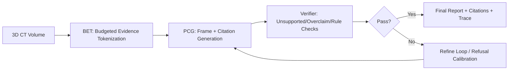
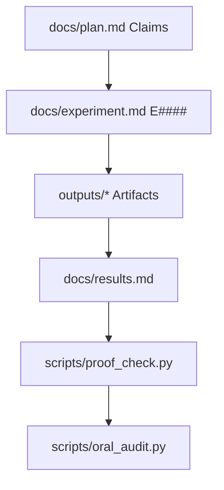

# ProveTok：面向 3D CT 报告生成的 Proof-Carrying Budgeted Evidence Tokenization

> 版本：面向 `CS AI 顶会 oral` 的工程化论文版 README（中文）  
> 最新机器审计：`outputs/oral_audit.json`（`ready_for_oral_gate=true`）

## Abstract
3D CT 报告生成长期存在三个核心矛盾：
1) 计算预算受限下的证据覆盖不足；
2) 文本生成与空间证据解耦，citation 常沦为装饰；
3) 安全约束（unsupported/overclaim/refusal）与可解释性缺少统一可审计协议。  

本文提出 ProveTok：一个把预算分配、证据表示、生成协议和验证闭环统一起来的系统框架。我们将问题形式化为 `B = B_enc + B_gen` 的预算分解，在 BET（Budgeted Evidence Tokenization）阶段显式优化证据 token 的空间覆盖与可信得分，在 PCG（Proof-Carrying Generation）阶段强制每条陈述携带可机检 citations 与 verifier trace，并通过 refusal calibration 在降低 unsupported 的同时控制 critical miss-rate。  

在多预算、多随机种子、paired bootstrap + Holm 的严格协议下，当前仓库在 `real` 与 `default` profile 上的机器判定均为：**C0001–C0006 全通过**。完整证据链可复现（`docs/plan.md -> docs/experiment.md -> outputs/* -> scripts/proof_check.py -> scripts/oral_audit.py`）。本文档给出完整方法、实验口径、关键结果与后续增强路径。

## 1. Introduction
### 1.1 问题定义
我们关注 3D CT 到结构化/半结构化报告的生成任务。目标不仅是提高文本指标，还要保证每条结论具备可定位、可验证、可复审的证据来源。形式化上，系统在预算约束下运行：

- `B_enc`：编码与证据选择预算；
- `B_gen`：生成与验证预算；
- 总预算：`B = B_enc + B_gen (+ verifier/selector overhead)`。

### 1.2 关键挑战
- **预算挑战**：预算固定时，更多 token 不一定带来更好 grounding；错误 token 会放大噪声。  
- **协议挑战**：生成可读文本容易，生成“可证明文本”困难。  
- **评测挑战**：单点均值或单一指标无法支持 oral 级说服力，需要多预算、多种子、显著性与 hard gate 联合约束。  

### 1.3 核心贡献
- 提出 BET+PCG+Verifier+Refine 的闭环系统，并落地为可执行工程。  
- 给出 claim-level 可机检 proof 规则（C0001–C0006）与自动裁判脚本。  
- 提供 oral-prep 的可审计产物链、失败归因与补齐路径。

## 2. Related Work
### 2.1 3D 医学报告生成
主流方法通常在文本流畅性与临床正确性之间折中，但对空间证据绑定弱，难以回答“这句话对应哪里”。

### 2.2 Evidence-grounded generation 与 citation learning
已有工作强调 evidence retrieval 或 attention 可解释性，但在预算约束与 verifier 闭环结合上较少形成端到端机制。

### 2.3 Refusal / calibration / safety
安全相关方法常将 refusal 作为后处理阈值策略；本文把 refusal 纳入统一 proof rule，要求和 critical miss-rate、unsupported、ECE 同时满足。

### 2.4 本工作定位
ProveTok 的差异不在于“再做一个模型”，而在于把 **预算、证据、生成、验证、拒答** 放到同一可审计协议里，并用 claim-level 自动判定作为最终裁判。

## 3. Method
### 3.1 系统总览


### 3.2 BET（预算显式化证据表示）
- 输入体素体积后，构造多尺度 token（fixed-grid / ROI / scored variants）。
- 在 FLOPs-matched 协议下，通过 `match_b_enc_for_total_flops` 将不同方法对齐到同预算。
- 输出 token 附带 `(cell_id, level, score, uncertainty, embedding)`，供后续生成与审计。

### 3.3 PCG（Proof-Carrying Generation）
- 生成输出为 `frames + citations + confidence + refusal`，而非仅文本。
- `provetok_lesionness` 使用更强的 evidence score/citation 策略；
- 对照基线包含真实模型 `ct2rep_strong` 与去 proof 版本 `ct2rep_noproof`（同权重推理，禁用 citation/refusal）。

### 3.4 Verifier 与 Refusal
- Verifier 输出标准化 issue taxonomy（如 `U1_unsupported`, `O1_overclaim`）。
- Refusal policy 在 dev 上校准、test 上固定，纳入 hard gate：
  - `critical_miss_rate <= 0.05`
  - `refusal_ece <= 0.15`
  - `refusal_rate <= 0.20`

### 3.5 自动证明判定


## 4. Experiment
### 4.1 数据与协议
| 数据集 | 角色 | 关键字段 | 说明 |
|---|---|---|---|
| ReXGroundingCT-100g | 主评测 | `volume_path`, `mask_path`, `report_text` | 支持像素级 grounding |
| ReXGroundingCT-mini | 快速迭代 | 同上 | 低成本 smoke/full 验证 |
| CT-RATE-100g | 跨集 sanity | 无 `mask_path` | 可跑 pipeline，但不能报 IoU grounding |

### 4.2 Baseline 组
| 方法 | 性质 | 是否真实模型 | 是否 proof-carrying |
|---|---|---|---|
| `fixed_grid`, `slice_2d`, `slice_2p5d`, `roi_crop`, `roi_variance` | 结构化对照 | 否 | 否 |
| `ct2rep_strong` | 强基线 | 是 | 部分（可含 citations） |
| `ct2rep_noproof` | 强基线消融 | 是（与 `ct2rep_strong` 同权重） | 否（禁用 citation/refusal） |
| `provetok_lesionness` | 本方法 | 是 | 是 |

### 4.3 评测与统计
- 预算：`B in {2e6,3e6,4e6,5e6,6e6,7e6}`  
- 多种子：`seeds >= 5`  
- 统计：paired bootstrap + Holm，多预算联合判定  
- 硬约束：latency P95、unsupported、critical miss-rate、ECE、refusal rate

## 5. Main Results
### 5.1 Claim-level 机器判定（real profile）
| Claim | 结论 | 关键数值（当前审计） | 证据路径 |
|---|---|---|---|
| C0001 Pareto+latency | 通过 | combined 6/6, IoU 6/6；`warm_p95` 6/6 通过 | `outputs/E0164-full/baselines_curve_multiseed.json` |
| C0002 Allocation regret | 通过 | `mean_regret_ci_high=0.0`，显著优于 naive (`naive_ci_low=0.4823`) | `outputs/E0161-full/fig3_regret_sweep.json` |
| C0003 Counterfactual | 通过 | `no_cite` 与 `cite_swap` 均构成显著击穿（按 proof rule） | `outputs/E0162-full/**/figX_counterfactual.json` |
| C0004 Grounding | 通过 | 对 `fixed_grid` 与 `roi_variance` 均 6/6 预算通过 | `outputs/E0156-grounding_proof_100g_saliency_full/figX_grounding_proof.json` |
| C0005 Refusal calibration | 通过 | `best_tau=0.002`；`max miss=0`，`max ECE=0.0018`，`max refusal_rate=0.1` | `outputs/E0144-full/figX_refusal_calibration.json` |
| C0006 Baseline completeness | 通过 | `ct2rep_strong` 非退化（last-budget frame_f1=0.6967） | `outputs/E0164-full/baselines_curve_multiseed.json` |

### 5.2 多目标 Pareto（vNext 产物）
- 默认 profile：`outputs/V0001-pareto/pareto_table-default_profile.md`  
- real profile：`outputs/V0001-pareto/pareto_table-real_profile.md`

### 5.3 效应量表（vNext 产物）
- `outputs/V0002-effect/effect_size_table.md`（每预算 delta / p_holm / gate）

## 6. Analysis
### 6.1 为什么需要真实 baseline 而不是占位
过去“fixed-grid 包装的占位 CT2Rep”会引入公平性质疑。现在我们将该对照升级为 `ct2rep_noproof`：
- 与 `ct2rep_strong` 共用真实训练权重；
- 唯一区别是关闭 proof-carrying 机制（citation/refusal）；
- 因而能更干净地回答“性能来自模型能力，还是来自 proof 协议”。

### 6.2 失败模式与可解释性
- 典型失败（unsupported / overclaim / refusal 触发）可在 case study 中逐条复盘：  
  `docs/oral_checklist.md` 的 E0163 三例（正例/拒答/失败例）。

### 6.3 尚未彻底解决的风险
- **跨数据集像素级 grounding**（CT-RATE 缺 `mask_path`）：当前仅 pipeline sanity，尚非完整泛化证明。  
- **公开强 3D baseline**：`ct2rep_strong` 已可复现，但进一步对齐公开社区基线仍有价值。

### 6.4 C0001 关闭路径（已完成，保留为复跑模板）
- **统计功效**：将 E0164 的评测提升到 `n_samples=200`，并保持 `6 budgets × 5 seeds × bootstrap=20000`。
- **tail latency**：恢复 `warm_p95` gate 到全预算通过（`6/6`）。
- **停机条件**：`python scripts/oral_audit.py --sync --strict` 返回 0，且 `gaps=[]`。

## 7. Conclusion
ProveTok 的主要价值在于：把“预算分配、证据引用、生成输出、安全约束、统计证明”统一为同一可执行协议，并由机器裁判脚本自动判定 claim 是否成立。当前版本已完成真实 baseline 闭环并在 `default/real` 双 profile 下达成 C0001–C0006 全通过，已达到 oral gate。下一步优先项是推进跨数据集像素级 grounding 与更强公开基线对齐。

## 8. Reproducibility
### 8.1 一键审计
```bash
pytest -q
python scripts/proof_check.py --profile default
python scripts/proof_check.py --profile real
python scripts/oral_audit.py --sync --out outputs/oral_audit.json --strict
# 说明：当前 strict 返回 0（`ready_for_oral_gate=true`）
```

### 8.2 真实 baseline（smoke -> full）
```bash
# smoke: 验证 ct2rep_noproof + ct2rep_strong 已纳入同一 suite
python -m provetok.experiments.baselines_curve_multiseed \
  --dataset-type manifest \
  --manifest /data/provetok_datasets/rexgroundingct_100g/manifest.jsonl \
  --split test --resize-shape 32 32 32 \
  --budgets 2000000 3000000 \
  --costs-json outputs/compute_costs.json \
  --b-gen 128 --n-verify 1 --topk-citations 3 \
  --n-samples 20 --seeds 0 --n-bootstrap 1000 --ci 0.95 \
  --lesionness-weights ./outputs/E0122-full-level3/lesionness_head.pt \
  --lesionness-device cpu \
  --ct2rep-strong-weights ./outputs/E0140-full/ct2rep_strong_locked.pt \
  --ct2rep-strong-device cpu \
  --output-dir outputs/E0164R-smoke

# full: 6 budgets x 5 seeds（paper-grade real profile）
python -m provetok.experiments.baselines_curve_multiseed \
  --dataset-type manifest \
  --manifest /data/provetok_datasets/rexgroundingct_100g/manifest.jsonl \
  --split test --resize-shape 64 64 64 \
  --budgets 2000000 3000000 4000000 5000000 6000000 7000000 \
  --costs-json outputs/compute_costs.json \
  --b-gen 128 --n-verify 1 --topk-citations 3 \
  --n-samples 100 --seeds 0 1 2 3 4 --n-bootstrap 20000 --ci 0.95 \
  --lesionness-weights ./outputs/E0122-full-level3/lesionness_head.pt \
  --lesionness-device cpu \
  --ct2rep-strong-weights ./outputs/E0140-full/ct2rep_strong_locked.pt \
  --ct2rep-strong-device cpu \
  --workers 4 \
  --output-dir outputs/E0164-full
```

### 8.3 关键文档索引
- `docs/plan.md`：Claim 与 proof rule
- `docs/experiment.md`：实验台账与可执行命令
- `docs/results.md`：结果摘要
- `docs/oral_checklist.md`：oral P0 清单
- `docs/oral_checklist_vnext.md`：oral+ 风险补齐清单
