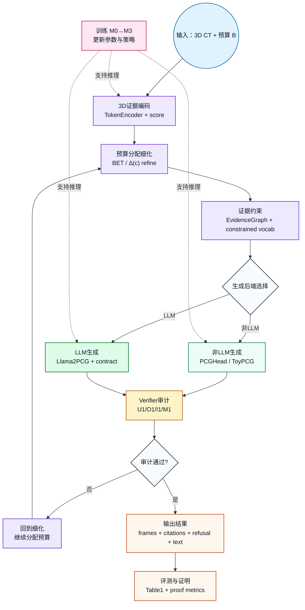

# ProveTok (pp.md v1.1 实施版)

本仓库当前主线以 `pp.md` + `docs/plan.md` + `docs/experiment.md` 为准，目标是把 **CT-RATE 的 Table1 口径**（含临床/结构/LLM 指标 + proof 指标 + 统计协议）做成 **可复现的一键流水线**，并支持把外部 baseline 的输出统一成 `pred_jsonl` 进入同一评测入口。

- 当前主线：CT-RATE（RRG-DPO 可比预处理）+ 内部方法变体 + 外部 baseline（先落地 CT2Rep）
- R1 当前口径：主实验使用 `128^3`；`64^3/256^3` 只做 ablation
- 暂缓（deferred）：`pp.md §6.1` 的 CT-RATE official split 复现
- 入口文档：`docs/plan.md`（范围/术语/claims）与 `docs/experiment.md`（可跑命令台账）

## 项目方法流程图（中文）

对应文件：
- `docs/public_artifacts/provetok_method_cn.md`
- `docs/public_artifacts/provetok_method_cn.mmd`


```mermaid
flowchart TB
classDef data fill:#E0F2FE,stroke:#0369A1,stroke-width:1.4px,color:#0F172A;
classDef core fill:#EDE9FE,stroke:#6D28D9,stroke-width:1.4px,color:#0F172A;
classDef gen fill:#ECFDF5,stroke:#047857,stroke-width:1.4px,color:#0F172A;
classDef llm fill:#DCFCE7,stroke:#15803D,stroke-width:1.6px,color:#0F172A;
classDef gate fill:#F8FAFC,stroke:#334155,stroke-width:1.6px,color:#0F172A;
classDef verify fill:#FEF3C7,stroke:#B45309,stroke-width:1.4px,color:#0F172A;
classDef out fill:#FFF7ED,stroke:#C2410C,stroke-width:1.4px,color:#0F172A;
classDef train fill:#FCE7F3,stroke:#BE185D,stroke-width:1.4px,color:#0F172A;

S((输入：3D CT + 预算 B)):::data
E1["3D证据编码<br/>TokenEncoder + score"]:::core
E2["预算分配细化<br/>BET / Δ(c) refine"]:::core
E3["证据约束<br/>EvidenceGraph + constrained vocab"]:::core
G{"生成后端选择"}:::gate
P["非LLM生成<br/>PCGHead / ToyPCG"]:::gen
L["LLM生成<br/>Llama2PCG + contract"]:::llm
V["Verifier审计<br/>U1/O1/I1/M1"]:::verify
D{"审计通过?"}:::gate
R["回到细化<br/>继续分配预算"]:::core
O["输出结果<br/>frames + citations + refusal + text"]:::out
M["评测与证明<br/>Table1 + proof metrics"]:::out
T["训练 M0→M3<br/>更新参数与策略"]:::train

S --> E1 --> E2 --> E3 --> G
G -- 非LLM --> P --> V
G -- LLM --> L --> V
V --> D
D -- 否 --> R --> E2
D -- 是 --> O --> M
T -. 支持推理 .-> E1
T -. 支持推理 .-> P
T -. 支持推理 .-> L
```

## 快速开始（跑通 Table1 主线）

主线实验按 `docs/experiment.md` 的 `E0214 → E0226 → E0227 → E0228 → E0229 → E0230`。

最省事的方式：用 `.rd_queue` 生成队列并运行（不会改代码，只会写日志/结果 JSON 与 outputs）。

```bash
# 生成 queue（只挑 full 阶段的这几个实验）
python scripts/rd_queue.py make --stage full --ids E0214 E0226 E0227 E0228 E0229 E0230 --out .rd_queue/queue_table1_full.json

# 在当前终端跑（无 tmux）；如需 tmux 用 scripts/rd_queue.py start
python scripts/rd_queue.py worker --queue .rd_queue/queue_table1_full.json

# 同步通过状态回 docs/experiment.md（只会勾选通过的 [x]）
python scripts/rd_queue.py sync
```

关键产物：
- `outputs/E0214-ct_rate_rrg_dpo_full/pairs.jsonl`
- `outputs/E0229-ct2rep_pred_full/preds_ct2rep.jsonl`
- `outputs/E0230-table1_with_ct2rep_full/paper_metrics.json`

`paper_metrics.json` 中会包含 R1 相关代理指标：`finding_precision / finding_recall / finding_f1 / abstention_rate`（基于 report 文本抽取，便于先做 round-by-round 修复）。

### 如果你现在只有原始 CT-RATE 文件（还没有 manifest）

先用下面脚本把本地体数据目录 + 报告表（csv/xlsx/jsonl）转成 `manifest.jsonl`：

```bash
python scripts/data/build_ct_rate_manifest.py \
  --ct-root /data/provetok_datasets/ct_rate_raw/dataset \
  --report-file /data/provetok_datasets/ct_rate_raw/reports.csv \
  --out-manifest /data/provetok_datasets/ct_rate_raw/manifest.jsonl \
  --dataset-name ct_rate_raw \
  --split-from path
```

然后再进入主线的 RRG-DPO 预处理：

```bash
python scripts/data/preprocess_manifest_rrg_dpo.py \
  --in-manifest /data/provetok_datasets/ct_rate_raw/manifest.jsonl \
  --out-root /data/provetok_datasets/ct_rate_100g_rrg_dpo_all \
  --splits train val test --dtype float16
```

## 外部 baselines 如何对比（体现 SOTA 的方式）

当前仓库对外部方法采用“输入统一化”的策略：外部 baseline 只需要导出

- `pred_jsonl`：每行 `{"sample_id": ..., "method": ..., "pred_text": ...}`

就能进入统一评测入口（Table1 + proof 指标 + paired 统计）。细节与模板见：
- `docs/external_baselines_adapter.md`
- `scripts/external/to_pred_jsonl.py`

SOTA 叙事建议以 **proof-centric reliability under budget** 为主（在相同预算与相同统计 family 下更稳、更难被 reviewer 质疑设定不公平）；文本指标用于“可比性/不退化”陈述。

## 文档结构（避免混淆）

- 当前主线：`docs/plan.md`, `docs/mohu.md`, `docs/experiment.md`
- 历史 oral/旧路线材料：`docs/legacy/oral_20260207/`

