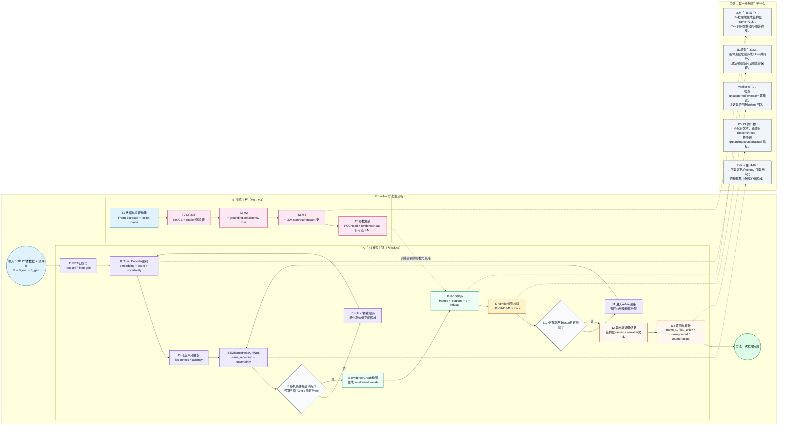

# ProveTok 项目方法流程图（中文版，按代码实现）

> 这份图只描述“方法本体”如何工作（训练 + 推理 + 验证 + 评测），不描述研发管理闭环。

## 1) 方法总图

## 2) 每一步作用（对应代码）

| 编号 | 作用 | 关键输入 | 关键输出 | 代码锚点 |
|---|---|---|---|---|
| I1 | 初始化 BET 空间划分（cell 集） | 3D volume, `B_enc` | 初始 cell 集 | `provetok/bet/refine_loop.py` |
| I2 | 把 cell 编码成 token（含 `cell_id/score/uncertainty/embedding`） | cell 集、volume、encoder | token 列表 | `provetok/bet/tokenize.py` |
| I3 | 融合 lesionness / saliency 分数，提升引用相关性 | token embeddings、评分头 | 重打分 token | `provetok/experiments/run_baselines.py` |
| I4 | 估计每个 cell 的边际收益 `Δ(c)` | 当前 issues + token embedding | 可 split cell 排序 | `provetok/bet/evidence_head.py` |
| I5-I6 | 在预算与收益约束下 split 最优 cell 并循环 | `Δ(c)`、`max_depth`、`epsilon` | 细粒度 token 覆盖 | `provetok/bet/refine_loop.py` |
| I7 | 从 token 构建证据图并导出 constrained vocab | token 列表 | `V_slot` 合法域 | `provetok/pcg/evidence_graph.py` |
| I8 | 生成 proof-carrying 输出（frames/citations/q/refusal） | token + `V_slot` | `Generation` | `provetok/models/pcg_head.py`、`provetok/pcg/generator.py`、`provetok/pcg/llama2_pcg.py` |
| I9 | 用规则 taxonomy 检测 unsupported/overclaim 等 | generation + tokens | issue 列表 + trace | `provetok/verifier/rules.py` |
| I10-I11 | 高风险 issue 触发继续 refine；否则停机 | issue 严重度 + 预算剩余 | 继续细化或输出 | `provetok/bet/refine_loop.py` |
| I12 | 输出双通道结果（结构化 + 可读文本） | frames/citations/refusal | narrative + trace | `provetok/types.py`、`provetok/pcg/narrative.py` |
| I13 | 量化方法有效性与可信性 | generation + GT/mask | frame/grounding/trust/cf 指标 | `provetok/eval/metrics_frames.py`、`provetok/eval/metrics_grounding.py`、`provetok/eval/counterfactual.py` |
| T1-T5 | M0→M3 训练路线（逐步加入 grounding 与 LLM） | stage config + dataset | 训练权重与策略 | `provetok/training/stages.py`、`provetok/training/trainer.py` |

## 3) 这张图如何解答“方法到底做了什么”

1. **预算如何生效**：I1~I6 明确 `B_enc` 用在“哪些空间区域被 token 化”。  
2. **证据如何绑定到文字**：I7~I8 把 token 证据强绑定到每个 frame 的 citation。  
3. **可信性怎么保证**：I9~I11 通过 verifier+refine 循环抑制 unsupported/overclaim。  
4. **为什么可审计**：I12~I13 输出结构化 trace 并可复算到 grounding/counterfactual 指标。  

## 4) 你最关心的两个问题（直答）

1. **我们为什么需要 3D 模型？**  
   因为任务要做的是“3D 空间证据绑定”，不是纯文本生成。3D 模型在 `I2/I3` 把体素区域转成 token 并打分，直接决定 citations 指向哪里；没有这一步，后面的 grounding 指标会塌。

2. **LLM 在哪里，负责什么？**  
   LLM 在 `I8`（推理时生成 frame+文本）和 `T4`（训练时合同/拒答约束）。不启用 LLM 时，系统仍可由 `PCGHead/ToyPCG` 跑通结构化输出与验证链路，但文本表达能力和合同泛化通常更弱。  
