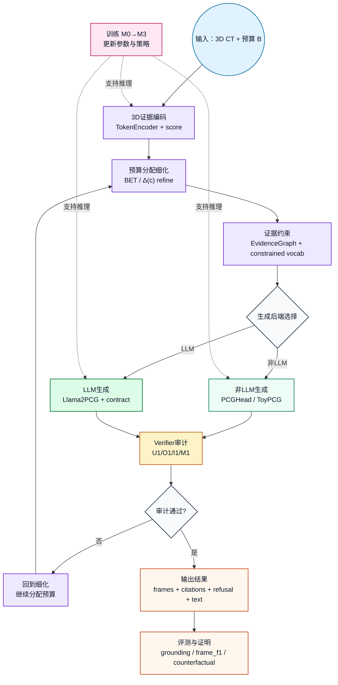

# ProveTok 方法路径图（全新单图版）

> 目标：一张图看清主链路，不再分“简版/详细版”两张图。

```mermaid
flowchart TB
classDef data fill:#E0F2FE,stroke:#0369A1,stroke-width:1.4px,color:#0F172A;
classDef core fill:#EDE9FE,stroke:#6D28D9,stroke-width:1.4px,color:#0F172A;
classDef gen fill:#ECFDF5,stroke:#047857,stroke-width:1.4px,color:#0F172A;
classDef llm fill:#DCFCE7,stroke:#15803D,stroke-width:1.6px,color:#0F172A;
classDef gate fill:#F8FAFC,stroke:#334155,stroke-width:1.6px,color:#0F172A;
classDef verify fill:#FEF3C7,stroke:#B45309,stroke-width:1.4px,color:#0F172A;
classDef out fill:#FFF7ED,stroke:#C2410C,stroke-width:1.4px,color:#0F172A;
classDef train fill:#FCE7F3,stroke:#BE185D,stroke-width:1.4px,color:#0F172A;

S((输入：3D CT + 预算 B)):::data
E1["3D证据编码<br/>TokenEncoder + score"]:::core
E2["预算分配细化<br/>BET / Δ(c) refine"]:::core
E3["证据约束<br/>EvidenceGraph + constrained vocab"]:::core
G{"生成后端选择"}:::gate
P["非LLM生成<br/>PCGHead / ToyPCG"]:::gen
L["LLM生成<br/>Llama2PCG + contract"]:::llm
V["Verifier审计<br/>U1/O1/I1/M1"]:::verify
D{"审计通过?"}:::gate
R["回到细化<br/>继续分配预算"]:::core
O["输出结果<br/>frames + citations + refusal + text"]:::out
M["评测与证明<br/>grounding / frame_f1 / counterfactual"]:::out
T["训练 M0→M3<br/>更新参数与策略"]:::train

S --> E1 --> E2 --> E3 --> G
G -- 非LLM --> P --> V
G -- LLM --> L --> V
V --> D
D -- 否 --> R --> E2
D -- 是 --> O --> M
T -. 支持推理 .-> E1
T -. 支持推理 .-> P
T -. 支持推理 .-> L
```

## 一句话定位

- 3D 模型作用在 `E1/E2`：把体素变成可审计证据并做预算细化。  
- LLM 作用在 `L`：作为生成后端消费证据，不替代证据链。  
- Verifier 作用在 `V`：不通过就回环到 `E2`，保证“可证明输出”。  
