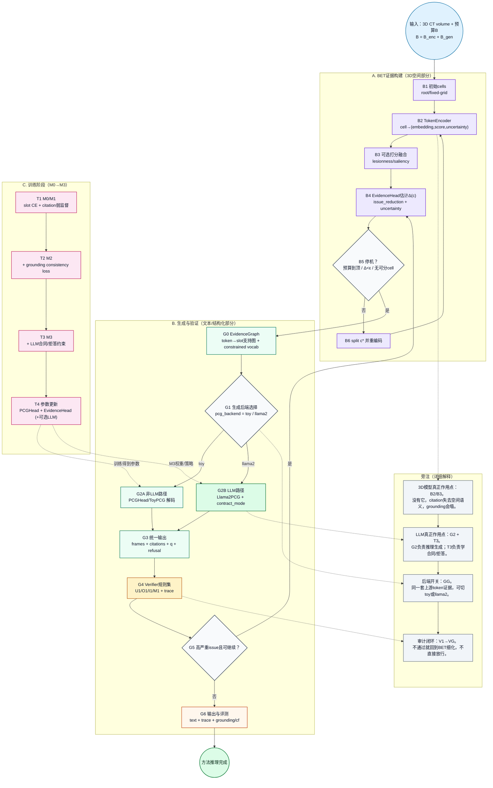

# ProveTok 方法流程图（详细版：LLM作用位展开）

> 这份是“看清 LLM 在哪里起作用”的专用图。建议先看简版，再看这里。

## 1) 详细流程图

## 2) LLM 作用位地图（最容易混淆的点）

| 位置 | 是否必须 | 作用 | 相关代码 |
|---|---|---|---|
| `G2` 推理端 | 可选 | 把 token 证据转成 `frames + text`，并输出 citations/q/refusal | `provetok/pcg/llama2_pcg.py` |
| `GG` 后端开关 | 必须 | 决定走 `toy` 还是 `llama2` 生成分支 | `provetok/experiments/run_baselines.py` (`pcg_backend`) |
| `T3` 训练端 M3 | 可选 | 在训练阶段学习合同约束/拒答策略 | `provetok/training/stages.py` |
| `T4 -> G2` | 条件依赖 | 只有开启 M3 / LLM 训练时才把该参数策略注入 LLM 生成分支 | `provetok/training/trainer.py`（stage config 驱动） |

## 3) 一句话回答“LLM 到底是不是核心”

- 对于这个项目，**3D 证据链（BET+Verifier）是底座**，LLM 是可切换的生成后端。  
- 没有 LLM，系统仍可跑完整证据闭环；没有 3D 证据链，LLM 只能“说得像”，很难满足 grounding 审计。  
